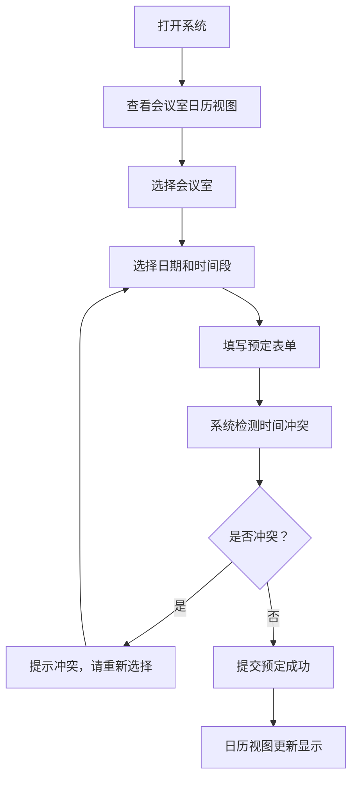

## 1. 产品概述

会议室预定系统是一款面向单位内部人员的单机版会议室管理工具，解决会议室资源调度冲突问题，提升办公效率。

- 主要用途：查看会议室占用情况、提交会议预定、避免时间冲突
- 目标用户：单位各科室工作人员
- 产品价值：简化预定流程，可视化展示会议室状态，减少沟通成本

## 2. 核心功能

### 2.1 用户角色

| 角色 | 登录方式 | 核心权限 |
|------|----------|----------|
| 普通用户 | 无需登录（单机版） | 查看会议室状态、提交预定、查看预定详情 |

### 2.2 功能模块

1. **日历视图区**：今日/本周视图切换、会议室切换、时间段展示、预定信息展示
2. **预定表单区**：会议主题、使用科室、参会人数、开始时间、结束时间、联系人
3. **会议室列表**：会议室名称、容量、当前状态
4. **冲突检测**：自动检测时间冲突、给出提示信息

### 2.3 页面详情

| 页面名称 | 模块名称 | 功能描述 |
|----------|----------|----------|
| 主页面 | 顶部导航栏 | 系统标题、日期切换（今日/本周）、会议室选择器 |
| 主页面 | 左侧会议室列表 | 展示所有会议室及其容量，点击可切换查看 |
| 主页面 | 中央日历视图 | 以时间轴形式展示会议室占用情况，支持今日/本周视图 |
| 主页面 | 右侧预定表单 | 填写会议信息并提交预定，实时检测冲突 |
| 主页面 | 预定详情弹窗 | 点击预定条目查看详细信息，支持取消预定 |

## 3. 核心流程

用户打开系统 → 查看当前会议室占用情况 → 选择会议室和时间段 → 填写会议信息 → 系统检测时间冲突 → 提交成功 → 日历视图更新显示

## 4. 用户界面设计

### 4.1 设计风格

- **主色调**：深靛蓝色 (#1e3a5f) 搭配天蓝色 (#3b82f6) 作为强调色
- **辅助色**：浅灰蓝背景 (#f1f5f9)、白色卡片 (#ffffff)
- **成功色**：翡翠绿 (#10b981)
- **警告色**：琥珀橙 (#f59e0b)
- **错误色**：玫红色 (#ef4444)
- **按钮风格**：圆角矩形，轻微阴影，悬停有上浮效果
- **字体**：使用 Noto Sans SC 中文显示字体，搭配 Inter 英文数字
- **布局风格**：三栏式布局，卡片式设计，清晰的视觉层次
- **图标风格**：线性风格图标，简洁现代

### 4.2 页面设计概述

| 页面名称 | 模块名称 | UI 元素 |
|----------|----------|---------|
| 主页面 | 顶部导航栏 | 系统logo、标题文字、视图切换按钮组、日期显示 |
| 主页面 | 会议室列表 | 垂直排列的卡片，显示房间名、容量、状态指示灯 |
| 主页面 | 日历视图 | 时间轴网格、预定色块（带主题和科室）、悬停效果、点击交互 |
| 主页面 | 预定表单 | 分组表单、输入框带图标、日期时间选择器、提交按钮带加载状态 |
| 主页面 | 详情弹窗 | 半透明遮罩、居中卡片、详细信息列表、操作按钮 |

### 4.3 响应式

- 桌面端为主设计（1280px 以上），三栏完整布局
- 平板端（768-1280px）：左右两栏，预定表单可折叠为抽屉
- 移动端（768px 以下）：单列布局，各模块依次排列，支持手势滑动切换日期

### 4.4 交互动效

- 页面加载时各模块依次淡入，有轻微位移
- 预定色块悬停时有放大和阴影加深效果
- 表单提交有加载动画，成功有绿色勾选反馈
- 弹窗出现有缩放和淡入效果
- 时间冲突提示有红色震动动画
