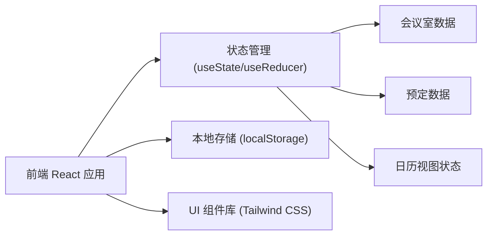
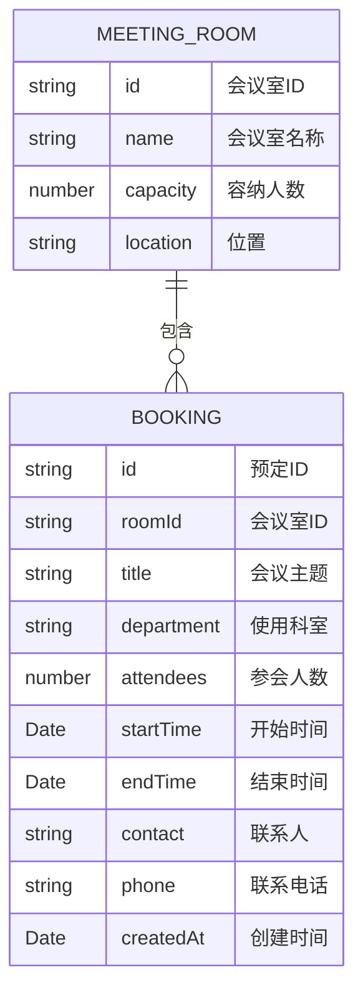

## 1. 架构设计



单机版架构，所有数据存储在浏览器 localStorage 中，无需后端服务。

## 2. 技术描述

- **前端框架**：React@18 + TypeScript
- **构建工具**：Vite@5
- **样式方案**：Tailwind CSS@3
- **图标库**：Lucide React
- **数据存储**：浏览器 localStorage（持久化存储）
- **日期处理**：date-fns（轻量级日期工具库）

## 3. 路由定义

| 路由 | 用途 |
|------|------|
| / | 主页面（日历视图 + 预定表单） |

由于是单机版单页应用，仅需一个主路由。

## 4. 数据模型

### 4.1 数据模型定义



### 4.2 TypeScript 类型定义

```typescript
interface MeetingRoom {
  id: string;
  name: string;
  capacity: number;
  location: string;
}

interface Booking {
  id: string;
  roomId: string;
  title: string;
  department: string;
  attendees: number;
  startTime: string;
  endTime: string;
  contact: string;
  phone: string;
  createdAt: string;
}

type ViewMode = 'day' | 'week';
```

### 4.3 初始数据

预置 4 个会议室数据：
- 大会议室（50人，3楼）
- 中会议室（20人，2楼）
- 小会议室（8人，2楼）
- 洽谈室（6人，1楼）

## 5. 核心功能实现

### 5.1 时间冲突检测算法

```typescript
function hasConflict(
  bookings: Booking[],
  roomId: string,
  startTime: Date,
  endTime: Date,
  excludeBookingId?: string
): boolean {
  return bookings
    .filter(b => b.roomId === roomId && b.id !== excludeBookingId)
    .some(b => {
      const bStart = new Date(b.startTime);
      const bEnd = new Date(b.endTime);
      return startTime < bEnd && endTime > bStart;
    });
}
```

### 5.2 本地存储封装

使用 localStorage 进行数据持久化，封装统一的存储操作方法。

### 5.3 日历视图渲染

- 日视图：24小时时间轴，每小时一格
- 周视图：7天 × 24小时网格
- 预定块根据时间段计算高度和位置

## 6. 组件结构

```
App
├── Header (顶部导航)
├── MainContent
│   ├── RoomList (左侧会议室列表)
│   ├── CalendarView (中央日历视图)
│   │   ├── DayView
│   │   └── WeekView
│   └── BookingForm (右侧预定表单)
└── BookingDetailModal (预定详情弹窗)
```

## 7. 性能与体验优化

- 日期计算使用 memo 缓存
- 预定渲染使用虚拟滚动（长列表时）
- 表单实时校验，提交前二次确认
- 加载状态和成功/失败反馈
